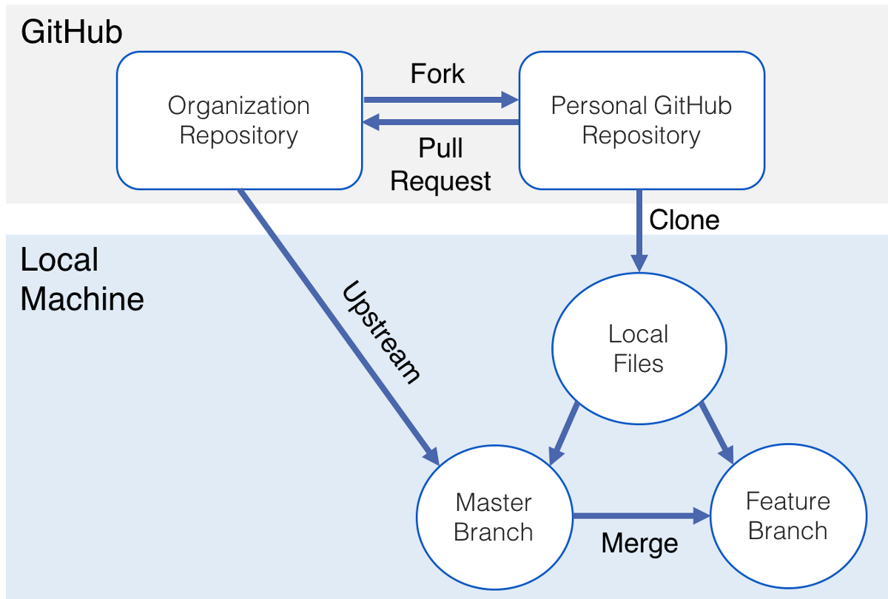

## Table of contents
- [Table of contents](#Table-of-contents)
- [Overview](#Overview)
    - [Technology Focus](#Technology-Focus)
    - [Monday Meeting Overview](#Monday-Meeting-Overview)
    - [Monday - Thursday Tasks](#Monday---Thursday-Tasks)
      - [WATCH / LEARN](#WATCH--LEARN)
      - [DO](#DO)
    - [Thursday Meeting Overview](#Thursday-Meeting-Overview)
    - [Student Feedback: (To be collected on the Thursday session)](#Student-Feedback-To-be-collected-on-the-Thursday-session)
    - [Thursday - Monday Tasks](#Thursday---Monday-Tasks)
      - [Watch / Read](#Watch--Read)

## Overview

#### Technology Focus

* Github - Verion Control
* Github Actions - CI

#### Monday Meeting Overview

As this meeting is week1 of the course and the student have not meet the instructors will spend the session going over the project and the project objectives.

We will describe the project and the technologies we are going to use. We will then spend the rest of the session talking about how we will use Github and Github actions. These two topics will be the main focus of the meeting.

#### Monday - Thursday Tasks

##### WATCH / LEARN

- Github:https://www.youtube.com/watch?v=SWYqp7iY_Tc 
- Github: https://rogerdudler.github.io/git-guide/ 
- Github:https://www.freecodecamp.org/news/an-introduction-to-git-for-absolute-beginners-86fa1d32ff71/  
- Github Actions: https://lab.github.com/githubtraining/github-actions:-continuous-integration -
- Github Actions: https://www.freecodecamp.org/news/what-are-github-actions-and-how-can-you-automate-tests-and-slack-notifications/

##### DO

- Fork this repo into your personal  git project.
- Understand Github authentication mechanisms.
- Go into the student_code folder pick a number and change the number to your name.
- Submit your change back to this main repo.
- If you have time Set this up on your own repo https://github.com/actions/starter-workflows/blob/94b77c19d0c15b2010a05c2dd7d1cac0c19b4b2a/ci/blank.yml
-  If you have time as a group set this up https://github.com/marketplace/actions/slack-notify on this main repo. Test on your own repo.
  - We may need to ask for SLACK API Key from Owen.

#### Thursday Meeting Overview

Catchup with students update and get consensus on progress
Discuss full git pr work flowback to main repo.  
 

#### Student Feedback: (To be collected on the Thursday session)

 - Solicit Feedback and open discussion.

#### Thursday - Monday Tasks

For students new to git move onto to github action.
For students not new to git move onto to github action that have a focus on security in your own repo.
We will stick to python for this for simplicity so get a python web package of your own making or clone one and build a pipelines with:

Sample Flask app to clone and test found [here](https://github.com/macloo/basic-flask-app)

    -  Enable Python Safety (SAST) Build Step
    -  Enable Crashtest Security (DAST) Build Step (see crashtest link below)
    -  Eanble SYNK Security (OSS) Build Step

##### Watch / Read 
- https://www.youtube.com/watch?v=rgbCcBNZcdQ (simple pr)
- https://wiki.crashtest-security.com/devsecops-pipeline
- https://github.com/snyk/actions
- 

